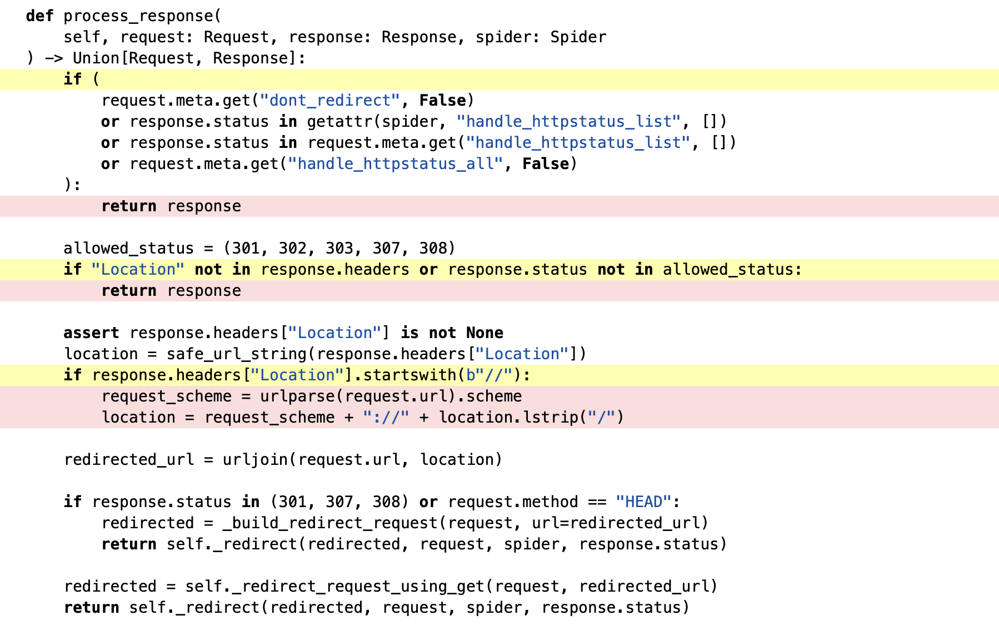
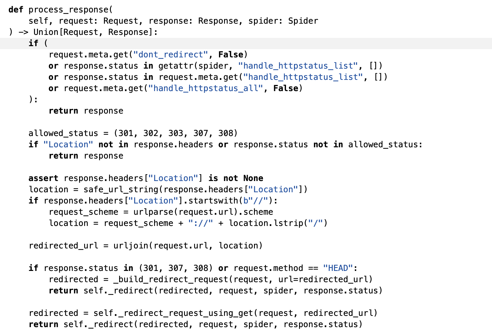

# Report for assignment 3

## Project

Name: Scrapy

URL: https://github.com/roxannecvl/scrapy/tree/master

We forked the Scrapy open source project which is a web scraper to perform
assignment 3 on.

## Structure 
Our project is devided in 3 main branches. 
1) The `master` branch which has the new tests we've created
2) The `coverage`branch which has the five functions with their adhoc tool, this branch was useful to see what our adhoc tools outputed before adding new tests
3) The `coverage and test` branch which has the adhoc tools and the new tests, this branch was useful to see what our adhoc tools outputed after adding new tests

Moreover there are one additional branch per member who wanted to aim for P+, these branch contain the refactoring of their function. You can find more information about this in the refactoring section of this report. 

## Statement of contribution 
In this report you will see for each section 5 sub-sections, one for each group member and their repective function(s) they've worked on. 
As a recap here is our statement of contribution : 

###### AIMING FOR P : 
**Alexander** : worked on _get_form in scrapy/scrapy/http/request/form.py, ....

**Rached** : ...

**Marcus** : ...

###### AIMING FOR P+ : 
**Roxanne** : I worked on process_response in scrapy/scrapy/downloadermiddlewares/redirect.py, I've created an adhoc tool for this function and 4 new tests to improve branch coverage. I also refactored this function in the `refactoring_process_response`branch. Moreover I've filled the **Structure**, **Statement of contribution** and **Self-assessment: Way of working** sections of this report and added my individual subsection for **Complexity**, **Refactoring**, **Coverage** and **Coverage improvement** sections. 

**Iley** : I worked on the _get_serialized_fields function in https://github.com/roxannecvl/scrapy/blob/master/scrapy/exporters.py
I created an adhoc coverage tool for this function and also added 4 new tests to it. Additionally I refactored the function which can be seen in the refactoring_serialized_function branch. Besides that I also wrote my individual subsection for **Complexity**, **Refactoring**, **Coverage** and **Coverage improvement**. 

## Onboarding experience

We started off with Pyspider which made use of a requirements.txt to
document the dependencies which Python has tools to download automatically.
Running the tests however, we discovered that somethings had been deprecated
meaning a major overhaul would be required to get the code running and we
therefore swapped project.

Scrapy's README.md itself didn't have that much documentation. You instead
have to navigate to their website which includes a bunch of documentation on
running, testing, how to contribute etc. Since the project is fairly large,
the setup process which uses a setup.py takes quite a bit of time. Running
the test suite also takes upwards of 10 minutes.

## Complexity

#### _get_form in scrapy/scrapy/http/request/form.py by Alexander

The function I am going to be looking at is _get_form in 
scrapy/http/request/form.py. Using the lizard tool, it assigns
the function a value of 12 CCN and an NLOC of 37. A manual count by
counting the decision points and adding 1 gives us a CCN of 12. Using
the calculation method from the lecture we instead get Number of
Decisions = 11, Exit Points = 7, totalling 11-7+2=6.

The purpose of the function is to find a form in an HTTP request.
There is not much documentation on this function since the convention
in Python is that functions starting with an underscore is supposed to
be Private, meaning it is only invoked within the class by another
function. The function is moderately convoluted and long because of
all the nested if-statements and all the exceptions that needs to
be taken into account.

The function that I am going to peer review in regards to Cyclomatic
Complexity Number is strip_url in scrapy/utils/url.py. Lizard gives
it a CCN of 12 and my manual count also leads to 12 assuming
counting the amount of decision points + 1 as well as the logical
operators 'or' and 'and' within the if statements.

#### process_response in scrapy/scrapy/downloadermiddlewares/redirect.py by Roxanne

##### The complexity 
At first, I worked on another function but latter realised that it was very well covered, I decided to switch the function process_response in scrapy/scrapy/downloadermiddlewares/redirect.py in the class RedirectMiddleware. 
To get the cyclomatic complexity of this function, I first use the lizard tool which outputed a CCN of 10. 
For the manual count part, I used two different methods, the one seen in class, where we get : Number of Decisions = 9, Exit Points = 4, totalling 9 - 4 + 2 = 6.
As this didn't match with the lizard output, I tried to find another way of counting and did several test with mini-functions I've created. It seems that lizard counts the CCN as Number of Decisions + 1, by doing that I get 9 + 1 = 10, same result as lizard ! 

##### The length of the function 
This function only has 24 NLOC which really is not that much, so I'd say that the length of a function is not directly related to its complexity, of course a function of 5 lines probably won't have a big complexity but the ratio CCN / NLOC can vary a lot from function to function 

##### The purpose of the function 
The purpose of my function is to handle redirection logic for HTTP responses within a Scrapy spider and ensure that requests are redirected appropriately based on the HTTP status codes and configuration settings. 

##### Exceptions 
My function doesn't throw any exceptions, however by doing some tests on small functions I've created, I've noticed that a try block could increment CCN. 

#### _get_serialized_fields in scrapy/scrapy/exporters.py by Iley
The function with high complexity that I chose to work on was the function called “_get_serialized_fields” which can be found in scrapy/scrapy/exporters.py . The way I found it was after using the Lizard tool where I noticed it had a cyclomatic complexity of 14 according to the tool which I deemed as a high complexity. The function I chose has 38 lines of code which is a pretty long function. I would not call it super long but it is definitely longer than an average function. This function does pretty much what the name of it suggests, it gets the fields of an item and serializes them. For this to be done all edge cases such as empty fields have to be taken into account which is one reason the cyclomatic complexity becomes large if you do all the functionality of the function in one singular function without breaking it into smaller pieces. So it makes sense that the cyclomatic complexity is high but as shown later the cyclomatic complexity could also be made smaller if splitting the function into smaller parts. However, something to consider is that having the high cyclomatic complexity may be worth it since it is potentially preferable directly being able to know what is related to this function and not scatter it in different functions.

The results for my complexity measurement with the Lizard tool was 14 with CCN. When I counted it manually I got 13 using the graph method shown in class but 14 with the method of counting the number of decision points and adding 1 to that result. Here are the results I got when doing the measurement myself: [https://drive.google.com/file/d/1nvRK9ayRpTvyunErwnD9VwYOH-0UaWjW/view?usp=sharing](https://drive.google.com/file/d/1nvRK9ayRpTvyunErwnD9VwYOH-0UaWjW/view?usp=sharing)

When it comes to exceptions the automated tool does take exceptions into account. The function I worked on does not have any type of exception handling though so it does not change the cyclomatic complexity of this particular function.

Lastly, there is not much documentation about the function I worked on. The function itself is probably not that hard to understand for someone who has worked a lot with similar functions but for someone like us in the group who are not as used to working with serialization of fields it can be hard and therefore more documentation could be good to have.
 
## Refactoring

#### _get_form in scrapy/scrapy/http/request/form.py by Alexander

To refactor _get_form would be a moderately difficult task as
the if statements contributing to its high complexity is
necessary for its function to extract values from a HTTP
file that can look in many different ways. As the function
can be seen as having 4-5 major if-statements that successively
goes deeper and deeper into the HTML file, one could break out
those into separate functions. The impact would be more readable
_get_form since you have abstracted those if-statements into
much fewer lines as a function call. Other than the impact
on readability, a potential drawback is that you clutter the
class with more functions that only serve the purpose of being
used in the _get_form function, making the file more convoluted
when looking at it from a high level. It becomes a trade-off
between readability of the individual function or the readability
of the whole class.


#### process_response in scrapy/scrapy/downloadermiddlewares/redirect.py by Roxanne

Refactoring of process_response wouldn't be too hard, here is how the function starts : 
```python
      if (
            request.meta.get("dont_redirect", False)
            or response.status in getattr(spider, "handle_httpstatus_list", [])
            or response.status in request.meta.get("handle_httpstatus_list", [])
            or request.meta.get("handle_httpstatus_all", False)
        ):
            return response

        allowed_status = (301, 302, 303, 307, 308)
        if "Location" not in response.headers or response.status not in allowed_status:
            return response
```
as you can see there are 6 cases in which we just return response, this bring the CCN to 6 already, therefore we could have a helper function `check_conditions(reponse, request, spider, allowed_status)` which checks for these 6 conditions and returns true if one of them does. Then these first lines of code would just be replaced by 
```python
if(check_conditions(reponse, request, spider, allowed_status)) : 
   return response
```
Which gives a CCN of 1 only.
Since I've decided to try to get P+ I've carried this out. 
This is done in the branch `refactoring_process_response` in `scrapy/scrapy/downloadermiddlewares/redirect.py` you may also check it by having a look at this commmit : https://github.com/roxannecvl/scrapy/commit/43fea2ec2a80b79294b0e4058ac1471f5510a5ad. When running the lizard tool on this branch we get a CCN of 5 for this function (compared to 10 before), so we reduced the cyclomatic complexity by 50%. 

The function then becomes easier to read, however if you want to understand well what it does you should check the helper function. So depending on how well you would like to understand the function, having the helper function might actually give you more work. 

#### _get_serialized_fields in scrapy/scrapy/exporters.py by Iley
The high complexity of the “_get_serialized_fields” function is not completely necessary since it could be split up instead into different functions. I did this in the “refactoring_serialized_function” branch. The way this was done was by splitting up the function into smaller pieces and making functions out of these pieces. Very little code had to be added or modified for this and therefore it was efficient and good process. In the end the function ended up with a much lower cyclomatic complexity because of this and arguably also more easy to understand since each function it was split into has an easy to understand name instead of all the code being in one big function without any comments.


## Coverage

### Tools

#### _get_form in scrapy/scrapy/http/request/form.py by Alexander

The coverage on the original Scrapy repo leads to this, and looking
up my function, it is mostly covered with a small gap which
we will address with an extra test case.
https://app.codecov.io/github/scrapy/scrapy/blob/master/scrapy%2Fhttp%2Frequest%2Fform.py

Using GitHub:s code indexing, we can see that _get_form is invoked once
from from_response in the same class. Looking for the relevant invocations
of this function, we find 64 calls all within tests/test_http_request.py
meaning we can cut down the test suite considerably when focusing on this
function alone.

Running this singular test file yields that 177 tests passed.

Using Coverage.py at first was tricky, I ran the test file with
coverage run -m unittest test_http_request.py and the report only
yielded the coverage of the test file itself. After some troubleshooting
the problem was that I didn't run the command from the root of the
repository, so I changed my location and command to
coverage run -m unittest tests/test_http_request.py.

I then generated coverage html and checked the function that I am interested
in. What I found is that most things is indeed covered at 96%. As for
the function I am interested in, there is 1 decision path that is not
covered.

#### process_response in scrapy/scrapy/downloadermiddlewares/redirect.py by Roxanne

First I used GitHub:s code indexiing and found out that my function was tested in two separated files : `tests/test_spidermiddleware_referer.py` and  `tests/test_downloadermiddleware_cookies.py`. 
I ran this two tests with the following command `coverage run -m unittest tests/test_spidermiddleware_referer.py tests/test_downloadermiddleware_cookies.py` and found out that there were 71 tests ran but 3 failing ones. By inspecting them I saw that the
three failing ones had the following comment : `@pytest.mark.xfail(reason="Cookie header is not currently being processed")` I therefore decided to comment them out since there weren't supposed to be run. I then had 68 passing test when running the command once again. 
By running `coverage html`afterwards I found out that my function was poorly covered. 3 paths were never testes, moreover there were many ways to access two of these paths (because of or conditions). 

#### _get_serialized_fields in scrapy/scrapy/exporters.py by Iley
I used Coverage.py to test the coverage for the function I was working on. I did this by checking the coverage for the tests relating to the exporters file which was where the function I was written. When doing this I noticed that the branch coverage for my function was 100%. 


### Your own coverage tool

#### _get_form in scrapy/scrapy/http/request/form.py by Alexander

I took the simple approach to manual instrumentation of my function by
creating an array and hardcoding in the function the different branches
if they are accessed with the array. At the end of the test class,
the array will be printed and thereby showing whether all branches
have been taken or not. Also added else clauses to the if without to
make sure that the path of the if clause being skipped exists.

In the test file, after all the tests have been ran, I run the function
that prints out this global array of what parts of the function have
been run, and the results correspond with the Lizard results
where one of the clauses did not get run.

#### process_response in scrapy/scrapy/downloadermiddlewares/redirect.py by Roxanne
Same as Alexander, I created a boolean array first filled in with False. Every time a branch is taken its spot in the array gets switched to True. Moreover if the condition leading to a new branch has mrore than one way of being fulfilled, I took that into account in my array. 
Here is an example of how I filled it out : 
```python 
If (a or b) : 
    do_something()
```
turns into 
```python 
If (a or b) : 
    if(a) : 
        coverage_array[x] = True
    elif(b) : 
        covergae_array[x + 1] = True
    do_something()
```

Then in the tear_down part of the two tests files I added a print of my coevrage_array so that you can see how it evolves after each test has passed. 

#### _get_serialized_fields in scrapy/scrapy/exporters.py by Iley
The way my coverage tool works is by having an array and each time a part of the function I am measuring the coverage for is visited that part of the array is set to True instead of False. So for example if the second branch of the function is visited the second boolean in my array would be set to True. Each time a test is run the coverage is printed out to the console which means that the last time it is printed out the final coverage is shown. One part which may seem very easy but was the hardest about making the coverage tool was to actaully get any output at all when running the tests in the tox testing environment. To make this work I added a -s flag in the tox.ini file on the pytest row which allowed prints to be done to the console while the tox tests were run. 


### Evaluation

#### _get_form in scrapy/scrapy/http/request/form.py by Alexander

The coverage measurement is hard-coded and crude and you have to manually locate
the corresponding line of code that has not been run from the terminal output.
One limitation to this approach is that if there are multiple test classes that
use this function, another approach would be required to assimilate the multiple
results since this approach relies on the class object staying persistent between
tests. The results of this tool is the same as the proper coverage tool, i.e.
I was able to locate the same clause that has not been run.

#### process_response in scrapy/scrapy/downloadermiddlewares/redirect.py by Roxanne
My coverage measurement is pretty detailed since as I've explained in `Your own coverage tool` section, if there are many ways to get into a branch (like an or in an if condition) it shows into the coverage array. Getting in with the second part of the or condition will not set the array to True at the same place as it would have been set by getting in with the first part of the or condition. 

The main limitation of my tool is that it clutters the code and impacts performance which are two major drawbacks. 

However, my tool's results are the same as the Coverage.py ones, the index in the array conresponding to branch that weren't evaluated according to the coverage tool were still set to False after having run all the tests. The branches being tested according to the Coverage tool had their index in the array set to True after all the tests were run. 

#### _get_serialized_fields in scrapy/scrapy/exporters.py by Iley
One big flaw of my test coverage tool is that the tool is specifically built for this function so any changes to the function mean the whole way of measuring the coverage would need to be redone or modified at least most likely. The tools is overall very simply and does not account for every kind of branch which is not optimal but enough for the scope of this assignment. 

When running my own coverage tool including my own test cases I got this result:
Coverage List: [True, True, True, True, True, True, False, True, True, True, True, True, True, True, False]

When running the coverage tool without my own test cases I got this result: 
[True, True, True, True, True, True, False, True, True, True, True, True, True, True, False]

As you can see the results are the same and not 100% as the [Coverage.py](http://Coverage.py) tool said. However it is interesting that the two parts that are false and not covered are ones I tried doing tests for but got errors when trying them so there is likely some error with that part which is not due to my way of measuring the coverage.

## Coverage improvement

#### _get_form in scrapy/scrapy/http/request/form.py by Alexander

The coverage for the class file I was working with was 96%, there
were 2 clauses unaccounted for in 2 different functions.

I added a test case for _get_inputs since there was one exception
that was not covered.

I added a test case for _get_form since there was one unused line
of code where one kind of input wasn't taken into account.

After adding these tests, the coverage report showed 99% and the
expected result of the 2 missing clauses now actually being
covered shows on the report as well as the manual instrumentation tool.

#### process_response in scrapy/scrapy/downloadermiddlewares/redirect.py by Roxanne
The coverage I got for the whole test files at first was 72%, and after running all tests the state of my own coverage array was : 
[True, False, False, False, False, False, False, False, True, False, True] (3 True, 8 False). Moreover, you could see with coverage html that 3 branches were never taken. 


I added four test cases for process_response (since I'm aiming for P+) and now the file is covered at 78% and the state of the array after all tests have passed is of : [True, True, False, False, False, True, True, True, True, False, True]. Moreover you can see with coverage html that every branch is taken. 

The reason why the whole array is not set to True is that there are many ways to get into a branch (because of ORs in if conditions) and not every one of them is taken. 

#### _get_serialized_fields in scrapy/scrapy/exporters.py by Iley
My function was already had 100% coverage as seen in the Coverage.py tool so I could not really ad more coverage. However there were still many parts that I felt could further improve the testing and path coverage, which means more paths in the code (ways of going through the function once) should be added. This I did by adding 4 test functions that are briefly and concisely described in the test file as a comment over the functions.

## Self-assessment: Way of working

Upon careful assessment of our team's activities, we have determined that the team is currently placed in between the "Formed" and the "Collaborating" state according to the Essence standard V1.2. In the last assignment we had placed ourselves in the "Collaborating" state, however we feel that this assignment has led to a regression in our team cohesion. Indeed, this assignment didn't call for a lot of collaboration, each team member could pick one function and progress at their own pace on their task. However, we tried setting up internal deadlines and Zoom meetings to stay on track. Unfortunately, these deadlines were not met by each group member and the zoom meetings were not always attended by everyone. This caused some of the trust in our team to break. Therefore we are still missing the condition "The team members know and trust each other" to fully be in "Collaborating". 
We still have to learn to trust each other and to adapt to the way of working of one another, some like to be done in advance while some work better under pressure. However, we are always on time for the final deadline. 
In other aspects our team works well, our communication is always open and honest and there is always one team member eager to help if another one needs it. We also improved our team cohesion by getting rid of some inconsistencies with our ways-of-working such as commit messages that weren't done in a unique way and now are. We believe that this small regression has taught us that progress is not always linear; we are now ready to do our best for the fourth and final assignment. 

## Overall experience

What are your main take-aways from this project? What did you learn?

Is there something special you want to mention here?