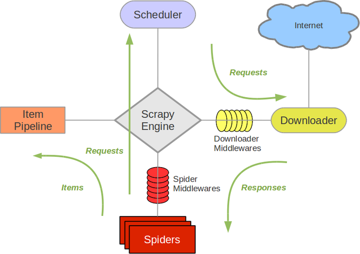

.. _topics-architecture:

=====================
Architecture overview
=====================

This document describes the architecture of Scrapy and how its components
interact.

Overview
========

The following diagram shows an overview of the Scrapy architecture with its
components and an outline of the data flow that takes place inside the system
(shown by the green arrows). A brief description of the components is included
below with links for more detailed information about them. The data flow is
also described below.

Components
==========

Scrapy Engine
-------------

The engine is responsible for controlling the data flow between all components
of the system, and triggering events when certain actions occur. See the Data
Flow section below for more details.

Scheduler
---------

The Scheduler receives requests from the engine and enqueues them for feeding
them later (also to the engine) when the engine requests them.

Downloader
----------

The Downloader is responsible for fetching web pages and feeding them to the
engine which, in turn, feeds them to the spiders.

Spiders
-------

Spiders are custom classes written by Scrapy users to parse responses and
extract items (aka scraped items) from them or additional URLs (requests) to
follow. For more information see :ref:`topics-spiders`.

Item Pipeline
-------------

The Item Pipeline is responsible for processing the items once they have been
extracted (or scraped) by the spiders. Typical tasks include cleansing,
validation and persistence (like storing the item in a database). For more
information see :ref:`topics-item-pipeline`.

Downloader middlewares
----------------------

Downloader middlewares are specific hooks that sit between the Engine and the
Downloader and process requests when they pass from the Engine to the
Downloader, and responses that pass from Downloader to the Engine.

Use a Downloader middleware if you need to do one of the following:

* process a request just before it is sent to the Downloader
  (i.e. right before Scrapy sends the request to the website);
* change received response before passing it to a spider;
* send a new Request instead of passing received response to a spider;
* pass response to a spider without fetching a web page;
* silently drop some requests.

For more information see :ref:`topics-downloader-middleware`.

Spider middlewares
------------------

Spider middlewares are specific hooks that sit between the Engine and the
Spiders and are able to process spider input (responses) and output (items and
requests).

Use a Spider middleware if you need to

* post-process output of spider callbacks - change/add/remove requests or items;
* post-process start_requests;
* handle spider exceptions;
* call errback instead of callback for some of the requests based on response
  content.

For more information see :ref:`topics-spider-middleware`.

Data flow
=========

The data flow in Scrapy is controlled by the execution engine, and goes like
this:

1. The Engine gets the first URLs to crawl from the Spider and schedules them
   in the Scheduler, as Requests.

2. The Engine asks the Scheduler for the next URLs to crawl.

3. The Scheduler returns the next URLs to crawl to the Engine and the Engine
   sends them to the Downloader, passing through the Downloader Middleware
   (request direction).

4. Once the page finishes downloading the Downloader generates a Response (with
   that page) and sends it to the Engine, passing through the Downloader
   Middleware (response direction).

5. The Engine receives the Response from the Downloader and sends it to the
   Spider for processing, passing through the Spider Middleware (input direction).

6. The Spider processes the Response and returns scraped items and new Requests
   (to follow) to the Engine.

7. The Engine passes scraped items and new Requests returned by a spider
   through Spider Middleware (output direction), and then sends processed
   items to Item Pipelines and processed Requests to the Scheduler.

8. The process repeats (from step 1) until there are no more requests from the
   Scheduler.

Event-driven networking
=======================

Scrapy is written with `Twisted`_, a popular event-driven networking framework
for Python. Thus, it's implemented using a non-blocking (aka asynchronous) code
for concurrency.

For more information about asynchronous programming and Twisted see these
links:

* `Introduction to Deferreds in Twisted`_
* `Twisted - hello, asynchronous programming`_
* `Twisted Introduction - Krondo`_

.. _Twisted: https://twistedmatrix.com/trac/
.. _Introduction to Deferreds in Twisted: https://twistedmatrix.com/documents/current/core/howto/defer-intro.html
.. _Twisted - hello, asynchronous programming: http://jessenoller.com/2009/02/11/twisted-hello-asynchronous-programming/
.. _Twisted Introduction - Krondo: http://krondo.com/an-introduction-to-asynchronous-programming-and-twisted/

