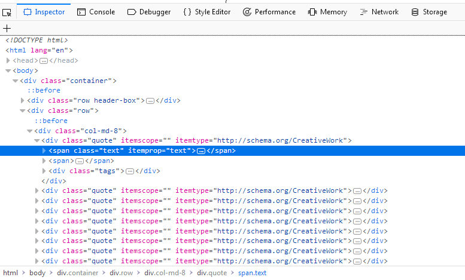
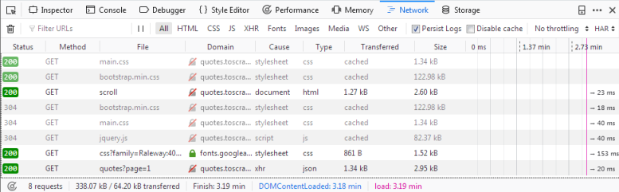
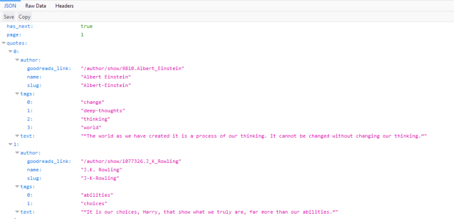

.. _topics-developer-tools:

=================================================
Using your browser's Developer Tools for scraping
=================================================

Here is a general guide on how to use your browser's Developer Tools
to ease the scraping process. Today almost all browsers come with
built in `Developer Tools`_ and although we will use Firefox in this
guide, the concepts are applicable to any other browser.

In this guide we'll introduce the basic tools to use from a browser's
Developer Tools by scraping `quotes.toscrape.com`_.

.. _topics-livedom:

Caveats with inspecting the live browser DOM
============================================

Since Developer Tools operate on a live browser DOM, what you'll actually see
when inspecting the page source is not the original HTML, but a modified one
after applying some browser clean up and executing Javascript code.  Firefox,
in particular, is known for adding ``<tbody>`` elements to tables.  Scrapy, on
the other hand, does not modify the original page HTML, so you won't be able to
extract any data if you use ``<tbody>`` in your XPath expressions.

Therefore, you should keep in mind the following things:

* Disable Javascript while inspecting the DOM looking for XPaths to be
  used in Scrapy (in the Developer Tools settings click `Disable JavaScript`)

* Never use full XPath paths, use relative and clever ones based on attributes
  (such as ``id``, ``class``, ``width``, etc) or any identifying features like
  ``contains(@href, 'image')``.

* Never include ``<tbody>`` elements in your XPath expressions unless you
  really know what you're doing

.. _topics-inspector:

Inspecting a website
====================

By far the most handy feature of the Developer Tools is the `Inspector`
feature, which allows you to inspect the underlying HTML code of
any webpage. To demonstrate the Inspector, let's look at the
`quotes.toscrape.com`_-site.

On the site we have a total of ten quotes from various authors with specific
tags, as well as the Top Ten Tags. Let's say we want to extract all the quotes
on this page, without any meta-information about authors, tags, etc.

Instead of viewing the whole source code for the page, we can simply right click
on a quote and select ``Inspect Element (Q)``, which opens up the `Inspector`.
In it you should see something like this:

The interesting part for us is this:

.. code-block:: html

    

      (...)
      (...)
      
(...)

    

If you hover over the first ``div`` directly above the ``span`` tag highlighted
in the screenshot, you'll see that the corresponding section of the webpage gets
highlighted as well. So now we have a section, but we can't find our quote text
anywhere.

The advantage of the `Inspector` is that it automatically expands and collapses
sections and tags of a webpage, which greatly improves readability. You can
expand and collapse a tag by clicking on the arrow in front of it or by double
clicking directly on the tag. If we expand the ``span`` tag with the ``class=
"text"`` we will see the quote-text we clicked on. The `Inspector` lets you
copy XPaths to selected elements. Let's try it out.

First open the Scrapy shell at http://quotes.toscrape.com/ in a terminal:

.. code-block:: none

    $ scrapy shell "http://quotes.toscrape.com/"

Then, back to your web browser, right-click on the ``span`` tag, select
``Copy > XPath`` and paste it in the Scrapy shell like so:

.. invisible-code-block: python

    response = load_response('http://quotes.toscrape.com/', 'quotes.html')

>>> response.xpath('/html/body/div/div[2]/div[1]/div[1]/span[1]/text()').getall()
['“The world as we have created it is a process of our thinking. It cannot be changed without changing our thinking.”']

Adding ``text()`` at the end we are able to extract the first quote with this
basic selector. But this XPath is not really that clever. All it does is
go down a desired path in the source code starting from ``html``. So let's
see if we can refine our XPath a bit:

If we check the `Inspector` again we'll see that directly beneath our
expanded ``div`` tag we have nine identical ``div`` tags, each with the
same attributes as our first. If we expand any of them, we'll see the same
structure as with our first quote: Two ``span`` tags and one ``div`` tag. We can
expand each ``span`` tag with the ``class="text"`` inside our ``div`` tags and
see each quote:

.. code-block:: html

    

      
        “The world as we have created it is a process of our thinking. It cannot be changed without changing our thinking.”
      
      (...)
      
(...)

    

With this knowledge we can refine our XPath: Instead of a path to follow,
we'll simply select all ``span`` tags with the ``class="text"`` by using
the `has-class-extension`_:

>>> response.xpath('//span[has-class("text")]/text()').getall()
['“The world as we have created it is a process of our thinking. It cannot be changed without changing our thinking.”',
'“It is our choices, Harry, that show what we truly are, far more than our abilities.”',
'“There are only two ways to live your life. One is as though nothing is a miracle. The other is as though everything is a miracle.”',
...]

And with one simple, cleverer XPath we are able to extract all quotes from
the page. We could have constructed a loop over our first XPath to increase
the number of the last ``div``, but this would have been unnecessarily
complex and by simply constructing an XPath with ``has-class("text")``
we were able to extract all quotes in one line.

The `Inspector` has a lot of other helpful features, such as searching in the
source code or directly scrolling to an element you selected. Let's demonstrate
a use case:

Say you want to find the ``Next`` button on the page. Type ``Next`` into the
search bar on the top right of the `Inspector`. You should get two results.
The first is a ``li`` tag with the ``class="next"``, the second the text
of an ``a`` tag. Right click on the ``a`` tag and select ``Scroll into View``.
If you hover over the tag, you'll see the button highlighted. From here
we could easily create a :ref:`Link Extractor <topics-link-extractors>` to
follow the pagination. On a simple site such as this, there may not be
the need to find an element visually but the ``Scroll into View`` function
can be quite useful on complex sites.

Note that the search bar can also be used to search for and test CSS
selectors. For example, you could search for ``span.text`` to find
all quote texts. Instead of a full text search, this searches for
exactly the ``span`` tag with the ``class="text"`` in the page.

.. _topics-network-tool:

The Network-tool
================
While scraping you may come across dynamic webpages where some parts
of the page are loaded dynamically through multiple requests. While
this can be quite tricky, the `Network`-tool in the Developer Tools
greatly facilitates this task. To demonstrate the Network-tool, let's
take a look at the page `quotes.toscrape.com/scroll`_.

The page is quite similar to the basic `quotes.toscrape.com`_-page,
but instead of the above-mentioned ``Next`` button, the page
automatically loads new quotes when you scroll to the bottom. We
could go ahead and try out different XPaths directly, but instead
we'll check another quite useful command from the Scrapy shell:

.. skip: next

.. code-block:: none

  $ scrapy shell "quotes.toscrape.com/scroll"
  (...)
  >>> view(response)

A browser window should open with the webpage but with one
crucial difference: Instead of the quotes we just see a greenish
bar with the word ``Loading...``.

.. image:: _images/network_01.png
   :width: 777
   :height: 296
   :alt: Response from quotes.toscrape.com/scroll

The ``view(response)`` command let's us view the response our
shell or later our spider receives from the server. Here we see
that some basic template is loaded which includes the title,
the login-button and the footer, but the quotes are missing. This
tells us that the quotes are being loaded from a different request
than ``quotes.toscrape/scroll``.

If you click on the ``Network`` tab, you will probably only see
two entries. The first thing we do is enable persistent logs by
clicking on ``Persist Logs``. If this option is disabled, the
log is automatically cleared each time you navigate to a different
page. Enabling this option is a good default, since it gives us
control on when to clear the logs.

If we reload the page now, you'll see the log get populated with six
new requests.

Here we see every request that has been made when reloading the page
and can inspect each request and its response. So let's find out
where our quotes are coming from:

First click on the request with the name ``scroll``. On the right
you can now inspect the request. In ``Headers`` you'll find details
about the request headers, such as the URL, the method, the IP-address,
and so on. We'll ignore the other tabs and click directly on ``Response``.

What you should see in the ``Preview`` pane is the rendered HTML-code,
that is exactly what we saw when we called ``view(response)`` in the
shell. Accordingly the ``type`` of the request in the log is ``html``.
The other requests have types like ``css`` or ``js``, but what
interests us is the one request called ``quotes?page=1`` with the
type ``json``.

If we click on this request, we see that the request URL is
``http://quotes.toscrape.com/api/quotes?page=1`` and the response
is a JSON-object that contains our quotes. We can also right-click
on the request and open ``Open in new tab`` to get a better overview.

With this response we can now easily parse the JSON-object and
also request each page to get every quote on the site::

    import scrapy
    import json

    class QuoteSpider(scrapy.Spider):
        name = 'quote'
        allowed_domains = ['quotes.toscrape.com']
        page = 1
        start_urls = ['http://quotes.toscrape.com/api/quotes?page=1']

        def parse(self, response):
            data = json.loads(response.text)
            for quote in data["quotes"]:
                yield {"quote": quote["text"]}
            if data["has_next"]:
                self.page += 1
                url = f"http://quotes.toscrape.com/api/quotes?page={self.page}"
                yield scrapy.Request(url=url, callback=self.parse)

This spider starts at the first page of the quotes-API. With each
response, we parse the ``response.text`` and assign it to ``data``.
This lets us operate on the JSON-object like on a Python dictionary.
We iterate through the ``quotes`` and print out the ``quote["text"]``.
If the handy ``has_next`` element is ``true`` (try loading
`quotes.toscrape.com/api/quotes?page=10`_ in your browser or a
page-number greater than 10), we increment the ``page`` attribute
and ``yield`` a new request, inserting the incremented page-number
into our ``url``.

.. _requests-from-curl:

In more complex websites, it could be difficult to easily reproduce the
requests, as we could need to add ``headers`` or ``cookies`` to make it work.
In those cases you can export the requests in `cURL <https://curl.haxx.se/>`_
format, by right-clicking on each of them in the network tool and using the
:meth:`~scrapy.http.Request.from_curl()` method to generate an equivalent
request::

    from scrapy import Request

    request = Request.from_curl(
        "curl 'http://quotes.toscrape.com/api/quotes?page=1' -H 'User-Agent: Mozil"
        "la/5.0 (X11; Linux x86_64; rv:67.0) Gecko/20100101 Firefox/67.0' -H 'Acce"
        "pt: */*' -H 'Accept-Language: ca,en-US;q=0.7,en;q=0.3' --compressed -H 'X"
        "-Requested-With: XMLHttpRequest' -H 'Proxy-Authorization: Basic QFRLLTAzM"
        "zEwZTAxLTk5MWUtNDFiNC1iZWRmLTJjNGI4M2ZiNDBmNDpAVEstMDMzMTBlMDEtOTkxZS00MW"
        "I0LWJlZGYtMmM0YjgzZmI0MGY0' -H 'Connection: keep-alive' -H 'Referer: http"
        "://quotes.toscrape.com/scroll' -H 'Cache-Control: max-age=0'")

Alternatively, if you want to know the arguments needed to recreate that
request you can use the :func:`~scrapy.utils.curl.curl_to_request_kwargs`
function to get a dictionary with the equivalent arguments:

.. autofunction:: scrapy.utils.curl.curl_to_request_kwargs

Note that to translate a cURL command into a Scrapy request,
you may use `curl2scrapy <https://michael-shub.github.io/curl2scrapy/>`_.

As you can see, with a few inspections in the `Network`-tool we
were able to easily replicate the dynamic requests of the scrolling
functionality of the page. Crawling dynamic pages can be quite
daunting and pages can be very complex, but it (mostly) boils down
to identifying the correct request and replicating it in your spider.

.. _Developer Tools: https://en.wikipedia.org/wiki/Web_development_tools
.. _quotes.toscrape.com: http://quotes.toscrape.com
.. _quotes.toscrape.com/scroll: http://quotes.toscrape.com/scroll
.. _quotes.toscrape.com/api/quotes?page=10: http://quotes.toscrape.com/api/quotes?page=10
.. _has-class-extension: https://parsel.readthedocs.io/en/latest/usage.html#other-xpath-extensions

