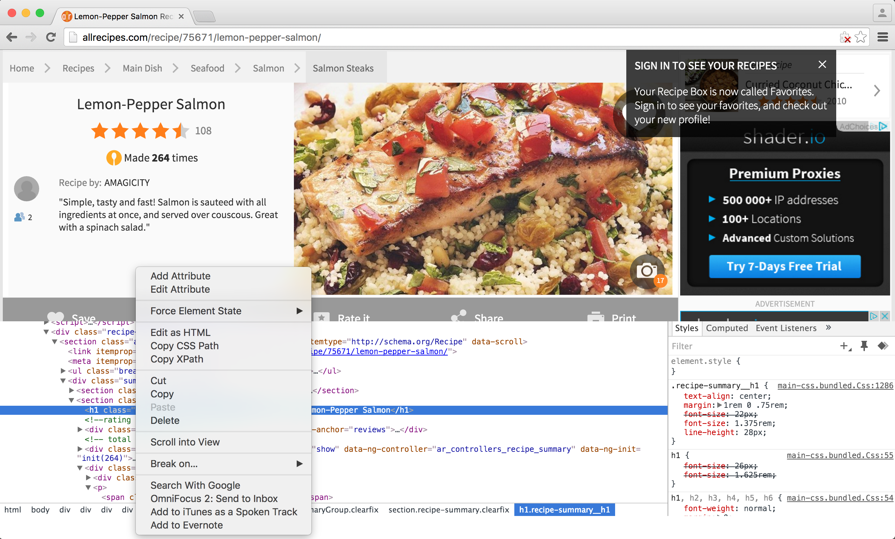
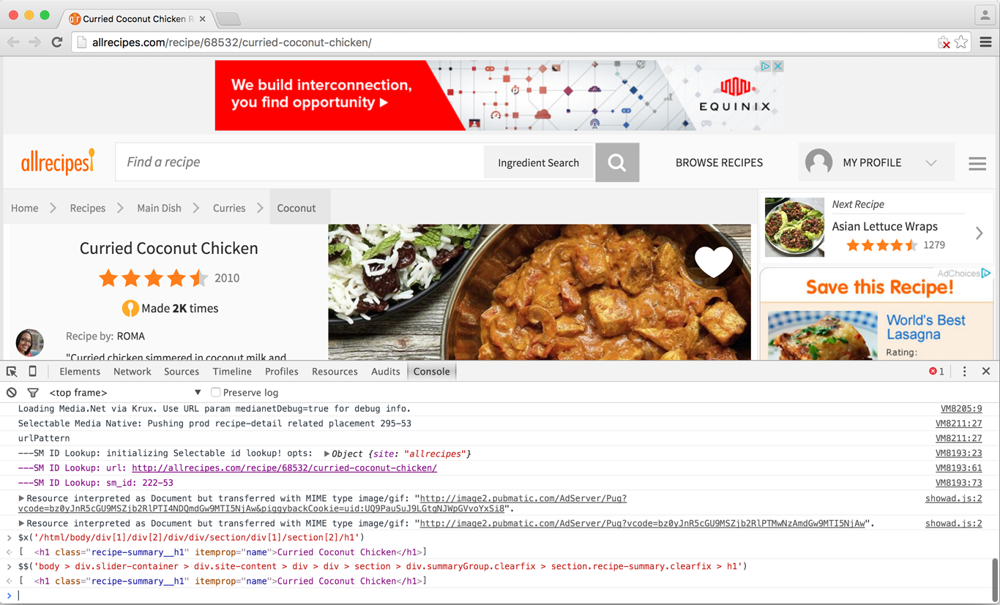
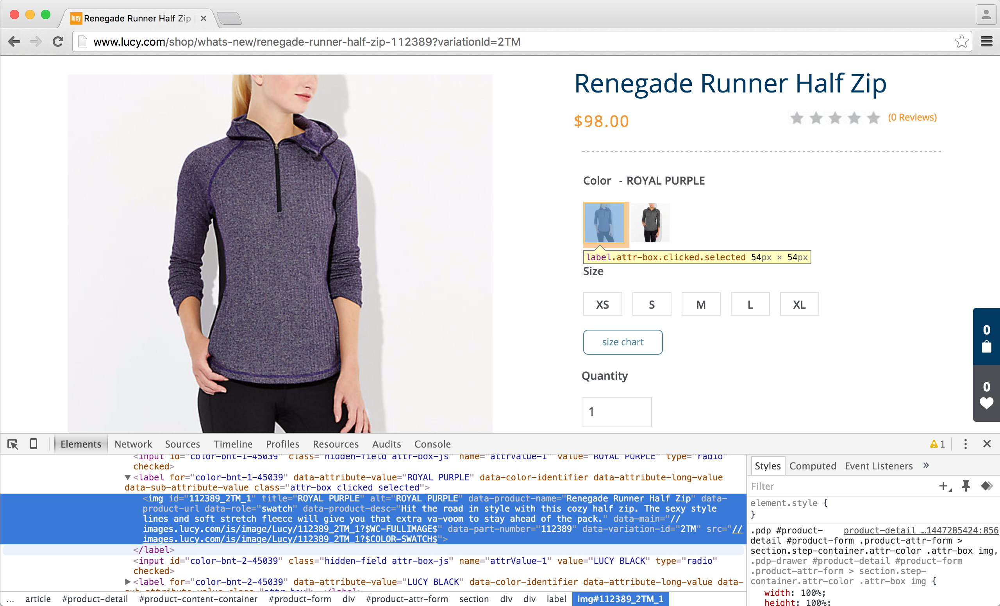
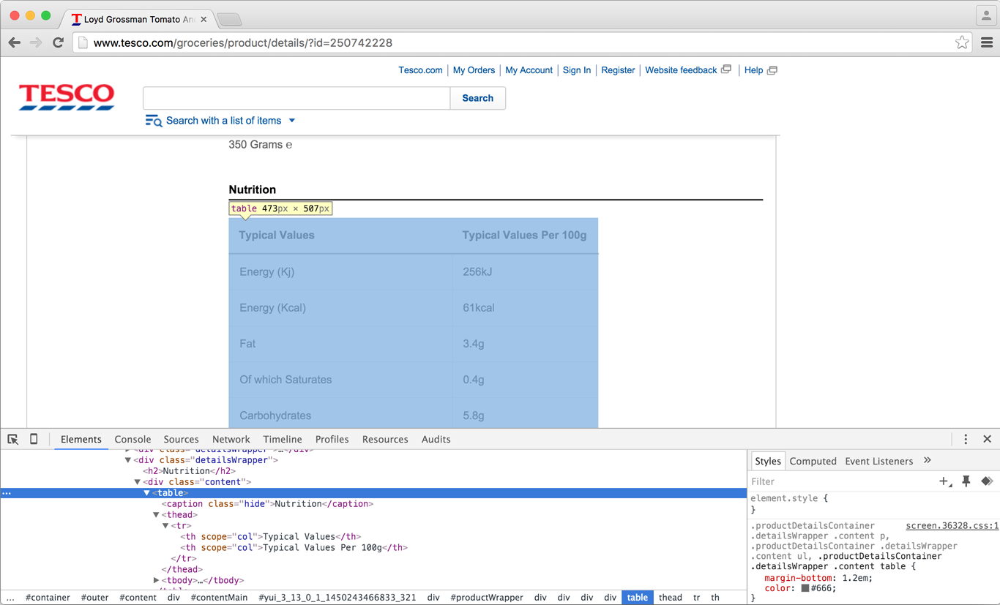

.. _topics-selectors-new:

=========
Selectors
=========

Selectors are Scrapy's mechanism for extracting data. They rely on `CSS <https://en.wikipedia.org/wiki/Cascading_Style_Sheets>`_ and `XPath <https://en.wikipedia.org/wiki/XPath>`_ expressions to select elements on the page.

CSS is short for Cascading Style Sheets and is used for styling web pages. It uses selectors to target elements on the page and set their attributes. CSS selectors in Scrapy follow exactly the same syntax, so any selectors that work in traditional CSS will work in Scrapy.

XPath is a language for selecting nodes from an XML document. You can use XPath to navigate the DOM of any XML-like format such as HTML.

Scrapy selectors are built on top of the `lxml <http://lxml.de/>`_ library, and perform very similarly in speed and parsing accuracy.

How to use selectors
====================

This tutorial will walk you through finding, testing, and using selectors in your Scrapy spiders.

We'll use a recipe from AllRecipes as an example::

    http://allrecipes.com/recipe/75671/lemon-pepper-salmon/

In Chrome, you can use the Developer Tools to select elements on the page and retrieve their XPath or CSS path:

.. note:: This tutorial uses Chrome, but Firefox, Safari, IE, Opera all have equivalent tools that you can use in the same manner.

If you wanted the recipe title, you can copy the CSS and get::

	body > div.slider-container > div.site-content > div > div > section > div.summaryGroup.clearfix > section.recipe-summary.clearfix > h1

And the XPath::

	/html/body/div[1]/div[2]/div/div/section/div[1]/section[2]/h1

We can use the ``$$`` and ``$x`` functions in the browser console to test both CSS and XPath selectors respectively. Let's test the selectors on `another page <http://allrecipes.com/recipe/68532/curried-coconut-chicken/>`_:

It works! However, both paths are very specific and the smallest change in page structure could break them. 

Also notice that the whole element is being selected, rather than just its text. We'll look at that soon, but for now let's see if there's a better way to select these elements. 

Notice the parent element's class is ``recipe-summary``, and the title's ``h1`` element has a class ``recipe-summary__h1``. It's much better to use these to identify the element as they are less likely to change in comparison to the page structure.

You can select by class in CSS like this::

	$$('.recipe-summary')

This will return an array of elements with the ``recipe-summary`` class. Next, select the ``h1`` child element::

	$$('.recipe-summary h1')
	[<h1 class="recipe-summary__h1" itemprop="name">Lemon-Pepper Salmon</h1>]

We can select the text by applying the relative XPath ``text()`` to the first result::

	> $x('text()', $$('.recipe-summary h1')[0])
	["Lemon-Pepper Salmon"]

We use XPath in the console here as standard CSS selectors don't support selecting text. This won't be necessary when building our spider because Scrapy includes a ``::text`` :ref:`pseudo-element <pseudo-classes>` for selecting text.

Let's try it using the Scrapy shell::

    $ scrapy shell http://allrecipes.com/recipe/68532/curried-coconut-chicken/
    >>> response.css('.recipe-summary h1::text').extract_first()
    u'Curried Coconut Chicken'

.. note:: ``.css()`` and ``.xpath()`` both return an array of selectors. We can get an array of values using ``.extract()``, but in this case we use ``.extract_first()`` to only retrieve data from the first selector.

Now that we have a selector, we can use it in a spider::

    def parse_item(self, response):
        ...
        item['title'] = response.css('.recipe-summary h1::text').extract_first()
        ...

This is the general process for creating selectors. You can use your browser to locate the element, and then use Scrapy shell to experiment with different selectors. From there, it's just a matter of including it in your spider.

Testing selectors
=================

When writing selectors, you want to be able to test them quickly against real documents. There are a couple of ways you can do this.

Scrapy shell
------------

Scrapy shell lets you test and debug scraping code without running a spider. It's especially useful when testing selectors.

You can open the shell in your terminal by entering::

    scrapy shell <url>

Where ``<url>`` is the URL of the page you want to test selectors against.

This will open up a Python shell with a ``response`` variable holding the ``Response`` object returned from the request. Here you can work with the response and test selectors and other logic you would apply in your ``parse`` method.

Web browser
-----------

Another way to test CSS and XPath selectors is using your browser's console::

    > $$('.recipe-summary__h1')              // CSS
    [<h1 class=​"recipe-summary__h1" itemprop=​"name">​Lemon-Pepper Salmon​</h1>​]
	> $x('//*[@class="recipe-summary__h1"]') // XPath
	[<h1 class=​"recipe-summary__h1" itemprop=​"name">​Lemon-Pepper Salmon​</h1>​]

Selecting data
==============

Selecting images
----------------

When you're scraping e-commerce sites, you usually want to gather the images too. Most sites make use of slideshows/galleries to display images, with controls to navigate between them. Luckily for us, most sites hold the images in the DOM, making them easy to scrape. Here we'll demonstrate how you can extract these images.

We'll use this page as an example::

    http://www.lucy.com/shop/whats-new/renegade-runner-half-zip-112389?variationId=2TM

We can use the dev tools in Chrome (or similar for Firefox/Safari/IE etc.) to inspect the images:

Notice that both of the elements have several descriptive attributes such as ``data-product-name``. We can use these in a selector to identify the images. In some cases, images are rendered using JavaScript, so you won't be able to read them without using Splash or a similar solution.

We can use Scrapy shell to ensure we can select the images::

    $ scrapy shell http://www.lucy.com/shop/whats-new/renegade-runner-half-zip-112389\?variationId\=
    >>> response.css('img').extract()
    [u'',
     u'',
     u'',
     u'',
     u'',
     u'',
     u'',
     u'',
     u'',
     u'',
     u'',
     u'',
     u'',
     u'',
     u'',
     u'',
     u'',
     u'',
     u'',
     u'',
     u'',
     u'',
     u'',
     u'',
     u'',
     u'',
     u'',
     u'',
     u'',
     u'',
     u'',
     u'',
     u'',
     u'',
     u'',
     u'',
     u'',
     u'',
     u'',
     u'']

The images are there, meaning they don't rely on JavaScript. To identify them, we can use the ``data-product-name`` attribute mentioned earlier::

    >>> response.css('img[data-product-name]').extract()
    [u'',
    u'']

The final step is to narrow it down to only the image URL. At first glance, it seems like selecting ``src`` is the answer. However, keep in mind that these are thumbnails, so instead you need to select the full image source. In this case, it's the ``data-main`` attribute::

    >>> response.css('img[data-product-name]::attr(data-main)').extract()
    [u'//images.lucy.com/is/image/Lucy/112389_2TM_1?$WC-FULLIMAGE$',
    u'//images.lucy.com/is/image/Lucy/112389_005_1?$WC-FULLIMAGE$']

.. note:: The ``::attr`` pseudo-element is Scrapy-specific and won't work in your browser's console. The equivalent XPath would be ``//img[@data-product-name]/@data-main``.

Selecting by content
--------------------

Let's use this product from Tesco.com as an example::

    http://www.tesco.com/groceries/product/details/?id=250742228

Say we want to extract the nutritional information. When inspecting the ``table`` element, you'll notice it doesn't have any unique ``id`` or ``class`` attributes to easily identify it:

Notice the ``h2`` element adjacent to the ``table``. We can use this to identify the table by selecting by content and then selecting the table descendant to the sibling element.

Standard CSS selectors don't support selecting by content, but Scrapy includes support for a ``:contains`` :ref:`pseudo-class <pseudo-classes>`. Let's open the page with Scrapy shell to test it::

    $ scrapy shell http://www.tesco.com/groceries/product/details/?id=250742228
    >>> response.css("h2:contains('Nutrition')")
    [<Selector xpath=u"descendant-or-self::h2[contains(., 'Nutrition')]" data=u'<h2>Nutrition</h2>'>]

Now we are able to select the ``h2`` element. Let's move onto selecting the sibling ``div`` element.

Selecting specific nodes
------------------------

Continuing with our previous example. We need to selecting the sibling ``div`` node in order to access the data in the table. We can do this using the adjacent sibling selector (``+``)::

    >>> response.css("h2:contains('Nutrition') + div.content")
    <Selector xpath=u"descendant-or-self::h2[contains(., 'Nutrition')]/following-sibling::*[@class and contains(concat(' ', normalize-space(@class), ' '), ' content ') and (name() = 'div') and (position() = 1)]" data=u'
<table><caption cla'>]

From there it's just a matter of selecting the descendant table's ``tbody``::

    >>> response.css("h2:contains('Nutrition') + div.content table tbody")
    [<Selector xpath=u"descendant-or-self::h2[contains(., 'Nutrition')]/following-sibling::*[@class and contains(concat(' ', normalize-space(@class), ' '), ' content ') and (name() = 'div') and (position() = 1)]/descendant-or-self::*/table/descendant-or-self::*/tbody" data=u'<tbody><tr><th scope="row">Energy (Kj)</'>]

We'll cover iterating through the rows and extracting the data in the next section.

Nesting selectors
-----------------

The ``.css()`` and ``.xpath()`` methods return a list of ``Selector`` objects, meaning you can apply the same method to select relative to that element.

To continue with our previous example, now that we have the table, we need to select its rows::

    >>> response.css("h2:contains('Nutrition') + div.content table tbody tr")
    [<Selector xpath=u"descendant-or-self::h2[contains(., 'Nutrition')]/following-sibling::*[@class and contains(concat(' ', normalize-space(@class), ' '), ' content ') and (name() = 'div') and (position() = 1)]/descendant-or-self::*/table/descendant-or-self::*/tbody/descendant-or-self::*/tr" data=u'<tr><th scope="row">Energy (Kj)</th><td>'>,
    <Selector xpath=u"descendant-or-self::h2[contains(., 'Nutrition')]/following-sibling::*[@class and contains(concat(' ', normalize-space(@class), ' '), ' content ') and (name() = 'div') and (position() = 1)]/descendant-or-self::*/table/descendant-or-self::*/tbody/descendant-or-self::*/tr" data=u'<tr><th scope="row">Energy (Kcal)</th><t'>,
    <Selector xpath=u"descendant-or-self::h2[contains(., 'Nutrition')]/following-sibling::*[@class and contains(concat(' ', normalize-space(@class), ' '), ' content ') and (name() = 'div') and (position() = 1)]/descendant-or-self::*/table/descendant-or-self::*/tbody/descendant-or-self::*/tr" data=u'<tr><th scope="row">Fat</th><td>3.4g</td'>,
    <Selector xpath=u"descendant-or-self::h2[contains(., 'Nutrition')]/following-sibling::*[@class and contains(concat(' ', normalize-space(@class), ' '), ' content ') and (name() = 'div') and (position() = 1)]/descendant-or-self::*/table/descendant-or-self::*/tbody/descendant-or-self::*/tr" data=u'<tr><th scope="row">Of which Saturates</'>,
    <Selector xpath=u"descendant-or-self::h2[contains(., 'Nutrition')]/following-sibling::*[@class and contains(concat(' ', normalize-space(@class), ' '), ' content ') and (name() = 'div') and (position() = 1)]/descendant-or-self::*/table/descendant-or-self::*/tbody/descendant-or-self::*/tr" data=u'<tr><th scope="row">Carbohydrates</th><t'>,
    <Selector xpath=u"descendant-or-self::h2[contains(., 'Nutrition')]/following-sibling::*[@class and contains(concat(' ', normalize-space(@class), ' '), ' content ') and (name() = 'div') and (position() = 1)]/descendant-or-self::*/table/descendant-or-self::*/tbody/descendant-or-self::*/tr" data=u'<tr><th scope="row">Of which Sugars</th>'>,
    <Selector xpath=u"descendant-or-self::h2[contains(., 'Nutrition')]/following-sibling::*[@class and contains(concat(' ', normalize-space(@class), ' '), ' content ') and (name() = 'div') and (position() = 1)]/descendant-or-self::*/table/descendant-or-self::*/tbody/descendant-or-self::*/tr" data=u'<tr><th scope="row">Fibre</th><td>0.8g</'>,
    <Selector xpath=u"descendant-or-self::h2[contains(., 'Nutrition')]/following-sibling::*[@class and contains(concat(' ', normalize-space(@class), ' '), ' content ') and (name() = 'div') and (position() = 1)]/descendant-or-self::*/table/descendant-or-self::*/tbody/descendant-or-self::*/tr" data=u'<tr><th scope="row">Protein</th><td>1.5g'>,
    <Selector xpath=u"descendant-or-self::h2[contains(., 'Nutrition')]/following-sibling::*[@class and contains(concat(' ', normalize-space(@class), ' '), ' content ') and (name() = 'div') and (position() = 1)]/descendant-or-self::*/table/descendant-or-self::*/tbody/descendant-or-self::*/tr" data=u'<tr><th scope="row">Salt</th><td>0.83g</'>,
    <Selector xpath=u"descendant-or-self::h2[contains(., 'Nutrition')]/following-sibling::*[@class and contains(concat(' ', normalize-space(@class), ' '), ' content ') and (name() = 'div') and (position() = 1)]/descendant-or-self::*/table/descendant-or-self::*/tbody/descendant-or-self::*/tr" data=u'<tr><th scope="row">This jar contains ap'>]

We can iterate through the array of selectors returned and extract data from each using nested selectors::

    >>> rows = response.css("h2:contains('Nutrition') + div.content table tbody tr")
    ... nutrition = {}
    ... for row in rows:
    ...     key = row.css('th::text').extract_first()
    ...     value = row.css('td::text').extract_first()
    ...     nutrition[key] = value
    >>> nutrition
    {u'Carbohydrates': u'5.8g',
    u'Energy (Kcal)': u'61kcal',
    u'Energy (Kj)': u'256kJ',
    u'Fat': u'3.4g',
    u'Fibre': u'0.8g',
    u'Of which Saturates': u'0.4g',
    u'Of which Sugars': u'4.8g',
    u'Protein': u'1.5g',
    u'Salt': u'0.83g',
    u'This jar contains approximately 2 portions': u'-'}

Using selectors with regular expressions
----------------------------------------

You can use the ``.re()`` method to extract data with regular expressions. Let's use this to process the nutritional values into a unit and quantity::

    >>> rows = response.css("h2:contains('Nutrition') + div.content table tbody tr")
    ... nutrition = {}
    ... for row in rows:
    ...     key = row.css('th::text').extract_first()
    ...     value = row.css('td::text').re('(\d+)([a-zA-Z]+)')
    ...     if len(value) == 2:
    ...         nutrition[key] = { 'unit': value[1], 'quantity': value[0] }
    >>> nutrition
    {u'Carbohydrates': {'quantity': u'8', 'unit': u'g'},
    u'Energy (Kcal)': {'quantity': u'61', 'unit': u'kcal'},
    u'Energy (Kj)': {'quantity': u'256', 'unit': u'kJ'},
    u'Fat': {'quantity': u'4', 'unit': u'g'},
    u'Fibre': {'quantity': u'8', 'unit': u'g'},
    u'Of which Saturates': {'quantity': u'4', 'unit': u'g'},
    u'Of which Sugars': {'quantity': u'8', 'unit': u'g'},
    u'Protein': {'quantity': u'5', 'unit': u'g'},
    u'Salt': {'quantity': u'83', 'unit': u'g'}}

We can also use the ``.re_first()`` method if we only want to extract the first matching string::

    >>> rows[0].css('td::text').re_first('(\d+)')
    u'256'

.. note:: Unlike using ``.xpath()`` or ``.css()`` methods, ``.re()`` returns a list of unicode strings. So you can't construct nested ``.re()`` calls.

Relative paths (XPath only)
---------------------------

Keep in mind that if you are nesting selectors and use an XPath that starts
with ``/``, that XPath will be absolute to the document and not relative to the
``Selector`` you're calling it from.

For example, suppose you want to extract all ``
`` elements inside ``
``
elements. First, you would get all ``
`` elements::

    >>> divs = response.xpath('//div')

At first, you may be tempted to use the following approach, which is wrong, as
it actually extracts all ``
`` elements from the document, not only those
inside ``
`` elements::

    >>> for p in divs.xpath('//p'):  # this is wrong - gets all 
 from the whole document
    ...     print p.extract()

This is the proper way to do it (note the dot prefixing the ``.//p`` XPath)::

    >>> for p in divs.xpath('.//p'):  # extracts all 
 inside
    ...     print p.extract()

Another common case would be to extract all direct ``
`` children::

    >>> for p in divs.xpath('p'):
    ...     print p.extract()

For more details about relative XPaths see the `Location Paths`_ section in the XPath specification.

.. _Location Paths: http://www.w3.org/TR/xpath#location-paths

EXSLT extensions
================

Scrapy selectors support some `EXSLT`_ extensions and come with these pre-registered namespaces to use in XPath expressions.

======  =====================================  =======================
Prefix  Namespace                              Usage
======  =====================================  =======================
re      \http://exslt.org/regular-expressions  `regular expressions`_
set     \http://exslt.org/sets                 `set manipulation`_
======  =====================================  =======================

Regular expressions
-------------------

EXSLT's regular expressions module is particularly useful when XPath's ``starts-with()`` and ``contains()`` aren't sufficient. You can use the ``re:test()`` function to match using regular expressions::

    >>> from scrapy import Selector
    >>> doc = """
    ... 

    ...     <ul>
    ...         <li class="item-0"><a href="link1.html">first item</a></li>
    ...         <li class="item-1"><a href="link2.html">second item</a></li>
    ...         <li class="item-inactive"><a href="link3.html">third item</a></li>
    ...         <li class="item-1"><a href="link4.html">fourth item</a></li>
    ...         <li class="item-0"><a href="link5.html">fifth item</a></li>
    ...     </ul>
    ... 

    ... """
    >>> sel = Selector(text=doc, type="html")
    >>> sel.xpath('//li//@href').extract()
    [u'link1.html', u'link2.html', u'link3.html', u'link4.html', u'link5.html']
    >>> sel.xpath('//li[re:test(@class, "item-\d$")]//@href').extract()
    [u'link1.html', u'link2.html', u'link4.html', u'link5.html']
    >>>

The example above shows selecting items from a list that end with a digit.

.. warning:: C library ``libxslt`` doesn't natively support EXSLT regular
    expressions so `lxml`_'s implementation uses hooks to Python's ``re`` module.
    Thus, using regexp functions in your XPath expressions may add a small
    performance penalty.

Set operations
--------------

These can be handy for excluding parts of a document tree before
extracting text elements for example.

Example extracting microdata (sample content taken from http://schema.org/Product)
with groups of itemscopes and corresponding itemprops::

    >>> doc = """
    ... 

    ...   Kenmore White 17" Microwave
    ...   
    ...   

    ...    Rated 3.5/5
    ...    based on 11 customer reviews
    ...   

    ...
    ...   

    ...     $55.00
    ...     <link itemprop="availability" href="http://schema.org/InStock" />In stock
    ...   

    ...
    ...   Product description:
    ...   0.7 cubic feet countertop microwave.
    ...   Has six preset cooking categories and convenience features like
    ...   Add-A-Minute and Child Lock.
    ...
    ...   Customer reviews:
    ...
    ...   

    ...     Not a happy camper -
    ...     by Ellie,
    ...     <meta itemprop="datePublished" content="2011-04-01">April 1, 2011
    ...     

    ...       <meta itemprop="worstRating" content = "1">
    ...       1/
    ...       5stars
    ...     

    ...     The lamp burned out and now I have to replace
    ...     it. 
    ...   

    ...
    ...   

    ...     Value purchase -
    ...     by Lucas,
    ...     <meta itemprop="datePublished" content="2011-03-25">March 25, 2011
    ...     

    ...       <meta itemprop="worstRating" content = "1"/>
    ...       4/
    ...       5stars
    ...     

    ...     Great microwave for the price. It is small and
    ...     fits in my apartment.
    ...   

    ...   ...
    ... 

    ... """
    >>> sel = Selector(text=doc, type="html")
    >>> for scope in sel.xpath('//div[@itemscope]'):
    ...     print "current scope:", scope.xpath('@itemtype').extract()
    ...     props = scope.xpath('''
    ...                 set:difference(./descendant::*/@itemprop,
    ...                                .//*[@itemscope]/*/@itemprop)''')
    ...     print "    properties:", props.extract()
    ...     print

    current scope: [u'http://schema.org/Product']
        properties: [u'name', u'aggregateRating', u'offers', u'description', u'review', u'review']

    current scope: [u'http://schema.org/AggregateRating']
        properties: [u'ratingValue', u'reviewCount']

    current scope: [u'http://schema.org/Offer']
        properties: [u'price', u'availability']

    current scope: [u'http://schema.org/Review']
        properties: [u'name', u'author', u'datePublished', u'reviewRating', u'description']

    current scope: [u'http://schema.org/Rating']
        properties: [u'worstRating', u'ratingValue', u'bestRating']

    current scope: [u'http://schema.org/Review']
        properties: [u'name', u'author', u'datePublished', u'reviewRating', u'description']

    current scope: [u'http://schema.org/Rating']
        properties: [u'worstRating', u'ratingValue', u'bestRating']

    >>>

Here we first iterate over ``itemscope`` elements, and for each one,
we look for all ``itemprops`` elements and exclude those that are themselves
inside another ``itemscope``.

.. _EXSLT: http://exslt.org/
.. _regular expressions: http://exslt.org/regexp/index.html
.. _set manipulation: http://exslt.org/set/index.html

Selector tips and gotchas
=========================

Using text nodes in a condition
-------------------------------

If you need to use the text content as an argument to an `XPath string function`_, use ``.`` instead of ``.//text()``.

This is because the expression ``.//text()`` yields a collection of text elements -- a *node-set*.
And when a node-set is converted to a string, which happens when it is passed as argument to
a string function like ``contains()`` or ``starts-with()``, it results in the text for the first element only.

Take the following example::

    >>> from scrapy import Selector
    >>> sel = Selector(text='<a href="#">Click here to go to the <strong>Next Page</strong></a>')

Converting a *node-set* to string::

    >>> sel.xpath('//a//text()').extract() # take a peek at the node-set
    [u'Click here to go to the ', u'Next Page']
    >>> sel.xpath("string(//a[1]//text())").extract() # convert it to string
    [u'Click here to go to the ']

Notice the text within the ``strong`` element is omitted. A *node* converted to a string, however, puts together the text of itself plus of all its descendants::

    >>> sel.xpath("//a[1]").extract() # select the first node
    [u'<a href="#">Click here to go to the <strong>Next Page</strong></a>']
    >>> sel.xpath("string(//a[1])").extract() # convert it to string
    [u'Click here to go to the Next Page']

So, using the ``.//text()`` node-set won't select anything in this case::

    >>> sel.xpath("//a[contains(.//text(), 'Next Page')]").extract()
    []

But using the ``.`` works::

    >>> sel.xpath("//a[contains(., 'Next Page')]").extract()
    [u'<a href="#">Click here to go to the <strong>Next Page</strong></a>']

.. _`XPath string function`: http://www.w3.org/TR/xpath/#section-String-Functions

Difference between //node[1] and (//node)[1]
--------------------------------------------

``//node[1]`` selects all the nodes occurring first under their respective parents.

``(//node)[1]`` selects all the nodes in the document, and then gets only the first of them.

Example::

    >>> from scrapy import Selector
    >>> sel = Selector(text="""
    ....:     <ul class="list">
    ....:         <li>1</li>
    ....:         <li>2</li>
    ....:         <li>3</li>
    ....:     </ul>
    ....:     <ul class="list">
    ....:         <li>4</li>
    ....:         <li>5</li>
    ....:         <li>6</li>
    ....:     </ul>""")
    >>> xp = lambda x: sel.xpath(x).extract()

This gets all first ``<li>``  elements under whatever it is its parent::

    >>> xp("//li[1]")
    [u'<li>1</li>', u'<li>4</li>']

And this gets the first ``<li>``  element in the whole document::

    >>> xp("(//li)[1]")
    [u'<li>1</li>']

This gets all first ``<li>``  elements under an ``<ul>``  parent::

    >>> xp("//ul/li[1]")
    [u'<li>1</li>', u'<li>4</li>']

And this gets the first ``<li>``  element under an ``<ul>``  parent in the whole document::

    >>> xp("(//ul/li)[1]")
    [u'<li>1</li>']

.. _topics-selectors-removing-namespaces:

Removing namespaces
-------------------

When dealing with scraping projects, it is often quite convenient to get rid of
namespaces altogether and just work with element names, to write more
simple/convenient XPaths. You can use the
:meth:`Selector.remove_namespaces` method for that.

Let's show an example that illustrates this with Github blog atom feed.

First, we open the shell with the url we want to scrape::

    $ scrapy shell https://github.com/blog.atom

Once in the shell we can try selecting all ``<link>`` objects and see that it
doesn't work (because the Atom XML namespace is obfuscating those nodes)::

    >>> response.xpath("//link")
    []

But once we call the :meth:`Selector.remove_namespaces` method, all
nodes can be accessed directly by their names::

    >>> response.selector.remove_namespaces()
    >>> response.xpath("//link")
    [<Selector xpath='//link' data=u'<link xmlns="http://www.w3.org/2005/Atom'>,
     <Selector xpath='//link' data=u'<link xmlns="http://www.w3.org/2005/Atom'>,
     ...

If you wonder why the namespace removal procedure isn't called always by default
instead of having to call it manually, this is because of two reasons, which, in order
of relevance, are:

1. Removing namespaces requires to iterate and modify all nodes in the
   document, which is a reasonably expensive operation to perform for all
   documents crawled by Scrapy

2. There could be some cases where using namespaces is actually required, in
   case some element names clash between namespaces. These cases are very rare
   though.

.. _Google Base XML feed: https://support.google.com/merchants/answer/160589?hl=en&ref_topic=2473799

.. _pseudo-classes:

Scrapy-specific CSS pseudo-classes and pseudo-elements
------------------------------------------------------

Scrapy supports a couple of pseudo-elements that aren't available in standard CSS. 

The ``::text`` pseudo-element lets you extract the element's text::

    >> response.css('h2::text')
    [<Selector xpath=u'descendant-or-self::h2/text()' data=u'Search'>,
    <Selector xpath=u'descendant-or-self::h2/text()' data=u'Add to basket'>,
    <Selector xpath=u'descendant-or-self::h2/text()' data=u'Product information'>,
    <Selector xpath=u'descendant-or-self::h2/text()' data=u'Description'>,
    <Selector xpath=u'descendant-or-self::h2/text()' data=u'Information'>,
    <Selector xpath=u'descendant-or-self::h2/text()' data=u'Nutrition'>,
    <Selector xpath=u'descendant-or-self::h2/text()' data=u'Using product information'>]

The ``::attr`` pseudo-element lets you retrieve the specified attribute value::

    >> response.css("a::attr('href')")
    [<Selector xpath=u'descendant-or-self::a/@href' data=u'http://www.tesco.com/termsandconditions/'>,
    <Selector xpath=u'descendant-or-self::a/@href' data=u'#'>,
    <Selector xpath=u'descendant-or-self::a/@href' data=u'#searchBox'>,
    <Selector xpath=u'descendant-or-self::a/@href' data=u'#contentMain'>,
    <Selector xpath=u'descendant-or-self::a/@href' data=u'#basketDock'>,
    <Selector xpath=u'descendant-or-self::a/@href' data=u'#primaryNav'>,
    <Selector xpath=u'descendant-or-self::a/@href' data=u'http://www.tesco.com'>,
    <Selector xpath=u'descendant-or-self::a/@href' data=u'http://www.tesco.com/groceries/dialogues'>,
    <Selector xpath=u'descendant-or-self::a/@href' data=u'http://www.tesco.com/groceries/Dialogues'>,
    <Selector xpath=u'descendant-or-self::a/@href' data=u'https://secure.tesco.com/register/?from='>,
    <Selector xpath=u'descendant-or-self::a/@href' data=u'https://secure.tesco.com/register/?newRe'>,
    ...

Because Scrapy uses lxml, the ``:contains`` pseudo-class is also supported. It allows you to select based on the content of the element::

    >>> response.css("h2:contains('Nutrition')")
    [<Selector xpath=u"descendant-or-self::h2[contains(., 'Nutrition')]" data=u'<h2>Nutrition</h2>'>]

Use CSS when querying by class
------------------------------

Because an element can contain multiple CSS classes, the XPath way to select elements
by class is the rather verbose::

    *[contains(concat(' ', normalize-space(@class), ' '), ' someclass ')]

If you use ``@class='someclass'`` you may end up missing elements that have
other classes, and if you just use ``contains(@class, 'someclass')`` to make up
for that you may end up with more elements that you want, if they have a different
class name that shares the string ``someclass``.

As it turns out, Scrapy selectors allow you to chain selectors, so most of the time
you can just select by class using CSS and then switch to XPath when needed::

    >>> from scrapy import Selector
    >>> sel = Selector(text='
<time datetime="2014-07-23 19:00">Special date</time>
')
    >>> sel.css('.shout').xpath('./time/@datetime').extract()
    [u'2014-07-23 19:00']

This is cleaner than using the verbose XPath trick shown above. Just remember
to use the ``.`` in the XPath expressions that will follow.

Use XPath when selecting by descendant node
-------------------------------------------

CSS doesn't support selecting by descendant node, so you will need to use XPath instead::

    >> response.xpath('//div[contains(h2, \'Nutrition\')]').extract()
    <Selector xpath="//div[contains(h2, 'Nutrition')]" data=u'
<h2>Nutritio'>]

The example above shows selecting a ``div`` whose descendant ``h2`` contains the text 'Nutrition'. This wouldn't be possible in CSS.

Selectors reference
===================

.. module:: scrapy.selector
   :synopsis: Selector class

.. class:: Selector(response=None, text=None, type=None)

  An instance of :class:`Selector` is a wrapper over response to select
  certain parts of its content.

  ``response`` is an :class:`~scrapy.http.HtmlResponse` or an
  :class:`~scrapy.http.XmlResponse` object that will be used for selecting and
  extracting data.

  ``text`` is a unicode string or utf-8 encoded text for cases when a
  ``response`` isn't available. Using ``text`` and ``response`` together is
  undefined behavior.

  ``type`` defines the selector type, it can be ``"html"``, ``"xml"`` or ``None`` (default).

    If ``type`` is ``None``, the selector automatically chooses the best type
    based on ``response`` type (see below), or defaults to ``"html"`` in case it
    is used together with ``text``.

    If ``type`` is ``None`` and a ``response`` is passed, the selector type is
    inferred from the response type as follow:

        * ``"html"`` for :class:`~scrapy.http.HtmlResponse` type
        * ``"xml"`` for :class:`~scrapy.http.XmlResponse` type
        * ``"html"`` for anything else

   Otherwise, if ``type`` is set, the selector type will be forced and no
   detection will occur.

  .. method:: xpath(query)

      Find nodes matching the xpath ``query`` and return the result as a
      :class:`SelectorList` instance with all elements flattened. List
      elements implement :class:`Selector` interface too.

      ``query`` is a string containing the XPATH query to apply.

      .. note::

          For convenience, this method can be called as ``response.xpath()``

  .. method:: css(query)

      Apply the given CSS selector and return a :class:`SelectorList` instance.

      ``query`` is a string containing the CSS selector to apply.

      In the background, CSS queries are translated into XPath queries using
      `cssselect`_ library and run ``.xpath()`` method.

      .. note::

          For convenience this method can be called as ``response.css()``

  .. method:: extract()

     Serialize and return the matched nodes as a list of unicode strings.
     Percent encoded content is unquoted.

  .. method:: re(regex)

     Apply the given regex and return a list of unicode strings with the
     matches.

     ``regex`` can be either a compiled regular expression or a string which
     will be compiled to a regular expression using ``re.compile(regex)``

  .. method:: register_namespace(prefix, uri)

     Register the given namespace to be used in this :class:`Selector`.
     Without registering namespaces you can't select or extract data from
     non-standard namespaces. See examples below.

  .. method:: remove_namespaces()

     Remove all namespaces, allowing to traverse the document using
     namespace-less xpaths. See example below.

  .. method:: __nonzero__()

     Returns ``True`` if there is any real content selected or ``False``
     otherwise.  In other words, the boolean value of a :class:`Selector` is
     given by the contents it selects.

.. _cssselect: https://pypi.python.org/pypi/cssselect/

SelectorList objects
--------------------

.. class:: SelectorList

   The :class:`SelectorList` class is a subclass of the builtin ``list``
   class, which provides a few additional methods.

   .. method:: xpath(query)

       Call the ``.xpath()`` method for each element in this list and return
       their results flattened as another :class:`SelectorList`.

       ``query`` is the same argument as the one in :meth:`Selector.xpath`

   .. method:: css(query)

       Call the ``.css()`` method for each element in this list and return
       their results flattened as another :class:`SelectorList`.

       ``query`` is the same argument as the one in :meth:`Selector.css`

   .. method:: extract()

       Call the ``.extract()`` method for each element in this list and return
       their results flattened, as a list of unicode strings.

   .. method:: re()

       Call the ``.re()`` method for each element in this list and return
       their results flattened, as a list of unicode strings.

   .. method:: __nonzero__()

        returns True if the list is not empty, False otherwise.

Constructing selectors
----------------------

.. highlight:: python

Scrapy selectors are instances of :class:`~scrapy.selector.Selector` class
constructed by passing **text** or :class:`~scrapy.http.TextResponse`
object. It automatically chooses the best parsing rules (XML vs HTML) based on
input type::

    >>> from scrapy.selector import Selector
    >>> from scrapy.http import HtmlResponse

Constructing from text::

    >>> body = '<html><body>good</body></html>'
    >>> Selector(text=body).xpath('//span/text()').extract()
    [u'good']

Constructing from response::

    >>> response = HtmlResponse(url='http://example.com', body=body)
    >>> Selector(response=response).xpath('//span/text()').extract()
    [u'good']

For convenience, response objects expose a selector on `.selector` attribute,
it's totally OK to use this shortcut when possible::

    >>> response.selector.xpath('//span/text()').extract()
    [u'good']

Selector examples on HTML response
----------------------------------

Here's a couple of :class:`Selector` examples to illustrate several concepts.
In all cases, we assume there is already a :class:`Selector` instantiated with
a :class:`~scrapy.http.HtmlResponse` object like this::

      sel = Selector(html_response)

1. Select all ``<h1>`` elements from an HTML response body, returning a list of
   :class:`Selector` objects (ie. a :class:`SelectorList` object)::

      sel.xpath("//h1")

2. Extract the text of all ``<h1>`` elements from an HTML response body,
   returning a list of unicode strings::

      sel.xpath("//h1").extract()         # this includes the h1 tag
      sel.xpath("//h1/text()").extract()  # this excludes the h1 tag

3. Iterate over all ``
`` tags and print their class attribute::

      for node in sel.xpath("//p"):
          print node.xpath("@class").extract()

Selector examples on XML response
---------------------------------

Here's a couple of examples to illustrate several concepts. In both cases we
assume there is already a :class:`Selector` instantiated with an
:class:`~scrapy.http.XmlResponse` object like this::

      sel = Selector(xml_response)

1. Select all ``<product>`` elements from an XML response body, returning a list
   of :class:`Selector` objects (ie. a :class:`SelectorList` object)::

      sel.xpath("//product")

2. Extract all prices from a `Google Base XML feed`_ which requires registering
   a namespace::

      sel.register_namespace("g", "http://base.google.com/ns/1.0")
      sel.xpath("//g:price").extract()

Further reading
===============

CSS
---

* https://developer.mozilla.org/en/docs/Web/Guide/CSS/Getting_started/Selectors
* http://www.w3.org/TR/css3-selectors/

XPath
-----

* http://www.zvon.org/comp/r/tut-XPath_1.html
* http://www.slideshare.net/scrapinghub/xpath-for-web-scraping
* http://blog.scrapinghub.com/2014/07/17/xpath-tips-from-the-web-scraping-trenches/
* http://www.w3.org/TR/xpath/