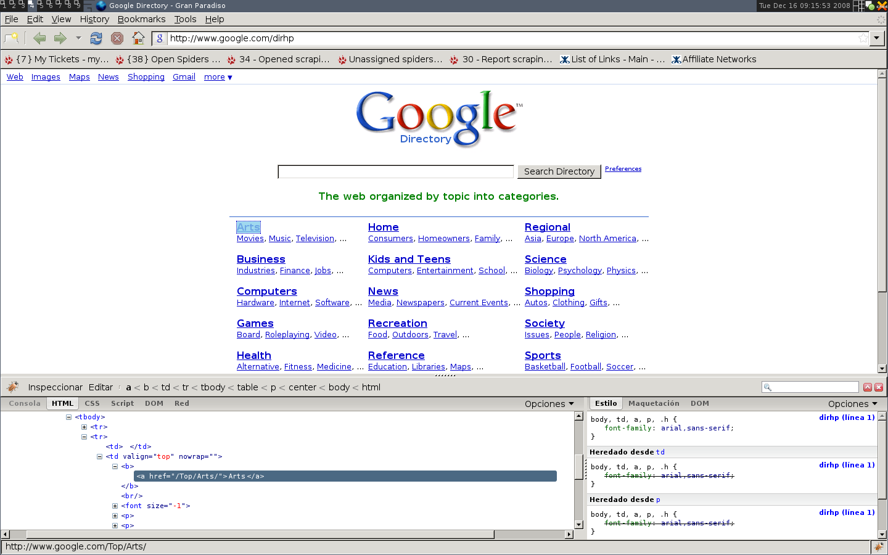
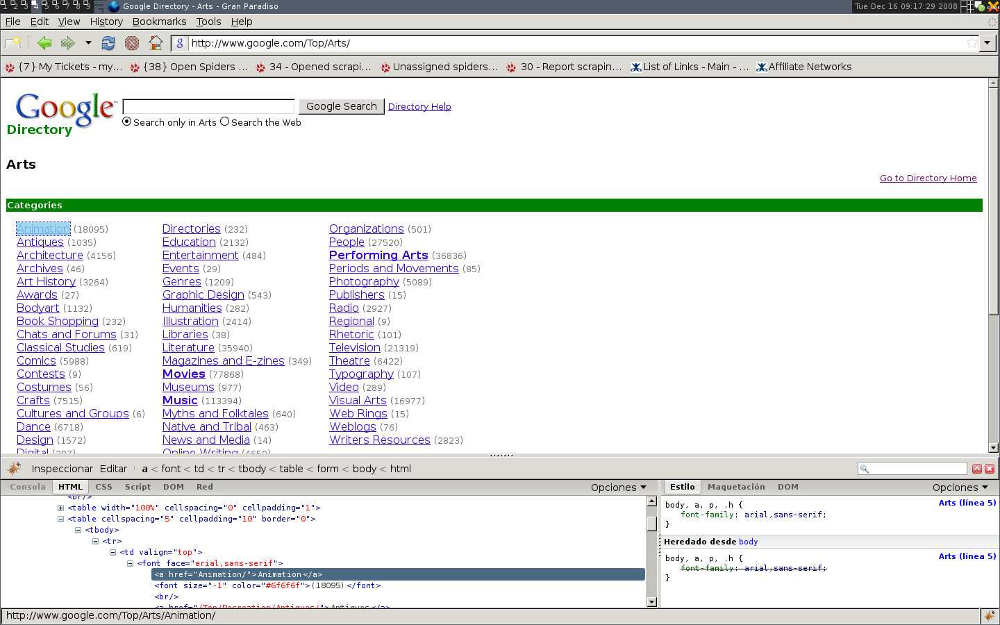

.. _tutorial2:

================
Our first spider
================

Ok, the time to write our first spider has come. Make sure that you're standing on your project's directory and run::

    ./scrapy-ctl genspider google_directory google.com

This should create a file called google_directory.py under the *spiders* directory looking like this::

    # -*- coding: utf8 -*-
    import re

    from scrapy.xpath import HtmlXPathSelector
    from scrapy.item import ScrapedItem
    from scrapy.link.extractors import RegexLinkExtractor
    from scrapy.contrib.spiders import CrawlSpider, Rule

    class GoogleDirectorySpider(CrawlSpider):
        domain_name = 'google.com'
        start_urls = ['http://www.google.com/']

        rules = (
            Rule(RegexLinkExtractor(allow=(r'Items/', )), 'parse_item', follow=True),
        )

        def parse_item(self, response):
            xs = HtmlXPathSelector(response)
            i = ScrapedItem()
            #i.attribute('site_id', xs.x('//input[@id="sid"]/@value'))
            #i.attribute('name', xs.x('//div[@id="name"]'))
            #i.attribute('description', xs.x('//div[@id="description"]'))
            return [i]

    SPIDER = GoogleDirectorySpider()

| Now, let's explain a bit what this is all about.
| As you may have noticed, the class that represents the spider is GoogleDirectorySpider, and it heredates from CrawlSpider.
| This means that this spider will crawl over a website given some crawling rules, and parse the response you need according to your patterns, which are defined through the "rules" class attribute.
| This attribute is nothing else but a tuple containing Rule objects. Each Rule defines a specific behaviour the spider will have while crawling the site.
| Rule objects accept the following parameters (the ones between [ ] are optional):

* *link_extractor* - A LinkExtractor instance, which defines the crawling patterns for this Rule.
* *[callback]* - A callback to be called for each link extracted matching the previous link extractor.
* *[cb_kwargs]* - A dictionary of keyword arguments to be passed to the provided callback.
* *[follow]* - A boolean that determines if links are going to be extracted from responses matching this Rule or not.
* *[process_links]* - An optional callback for parsing the extracted links.

| In this case, the Rule would mean something like "search for any url containing the string 'Items/', parse it with the 'parse_item' method, and try to extract more links from it".
| Now, that's an example, so we must make our own Rule for our own spider.
| But before that, we must set our start_urls to our real entry point (which is not actually Google's homepage).

So we replace that line with::

    start_urls = ['http://www.google.com/dirhp']

Now it's the moment to surf that page, and see how we can do to extract data from it.
For this task is almost mandatory that you have Firefox FireBug extension, which allows you to browse through HTML markup in an easy and comfortable way. Otherwise you'd have
to search for tags manually through the body, which can be *very* tedious.

What we see at first sight, is that the directory is divided in categories, which are also divided in subcategories.
However, it seems as if there are more subcategories than the ones being shown in this page, so we'll keep looking...

Hmmkay... The only new thing here is that there are lots of subcategories, let's see what's inside them...

.. image:: scrot3.png

| Right, this looks more interesting. Not only subcategories themselves have more subcategories, but they have links to websites (which is in fact the purpose of the directory).
| Now, there's basically one thing to take into account about the previous, and it's the fact that apparently, categories urls are always of the kind *http://www.google.com/Category/Subcategory/Another_Subcategory* (which is not very distinctive actually, but possible to use).

So, having said that, a possible rule set for the categories could be::

    rules = (
        Rule(RegexLinkExtractor(allow=('google.com/[A-Z][a-zA-Z_/]+$', ), ),
            'parse_category',
            follow=True,
        ),
    )

| Basically, we told our Rule object to extract links that contain the string 'google.com/' plus any capital letter, plus any letter, the '_' character or the '/'.
| Also, we set our callback 'parse_category' for each of those crawled links, and decided to extract more links from them with follow=True.

Until now, our spider would look something like::

    # -*- coding: utf8 -*-
    from scrapy.xpath import HtmlXPathSelector
    from scrapy.item import ScrapedItem
    from scrapy.link.extractors import RegexLinkExtractor
    from scrapy.contrib.spiders import CrawlSpider, Rule

    class GoogleDirectorySpider(CrawlSpider):
        domain_name = 'google.com'
        start_urls = ['http://www.google.com/dirhp']

        rules = (
            Rule(RegexLinkExtractor(allow=('google.com/[A-Z][a-zA-Z_/]+$', ), ),
                'parse_category',
                follow=True,
            ),
        )

        def parse_category(self, response):
            pass

    SPIDER = GoogleDirectorySpider()

You can try crawling with this little code, by running::

    ./scrapy-ctl crawl google.com

and it will actually work, altough it won't do any parsing, since parse_category is not defined, and that's exactly what we're going to do now.

As you can see in any page containing links to websites in the directory (e.g. http://www.google.com/Top/Arts/Awards/), those links are preceded by a
ranking bar. That could be a nice reference at the moment of selecting an area with an XPath expression.
Let's use FireBug and see how we can identify those bars.

[IMG]

As you can see, we loaded the page in the Scrapy shell, and tried an XPath expression for finding the ranking bars, which actually worked!
So, a possible *parse_category* could be::

    def parse_category(self, response):
        items = [] # The item (links to websites) list we're going to return
        hxs = HtmlXPathSelector(response) # The selector we're going to use in order to extract data from the page
        links = hxs.x('//td[descendant::a[contains(@href, "#pagerank")]]/following-sibling::td//a')

        for link in links:
            item = ScrapedItem()
            item.set_attrib_adaptors('name', [adaptors.extract, adaptors.Delist('')])
            item.set_attrib_adaptors('url', [adaptors.extract, adaptors.Delist('')])
            item.attribute('name', link.x('text()'))
            item.attribute('url', link.x('@href'))
            items.append(item)

        return items

