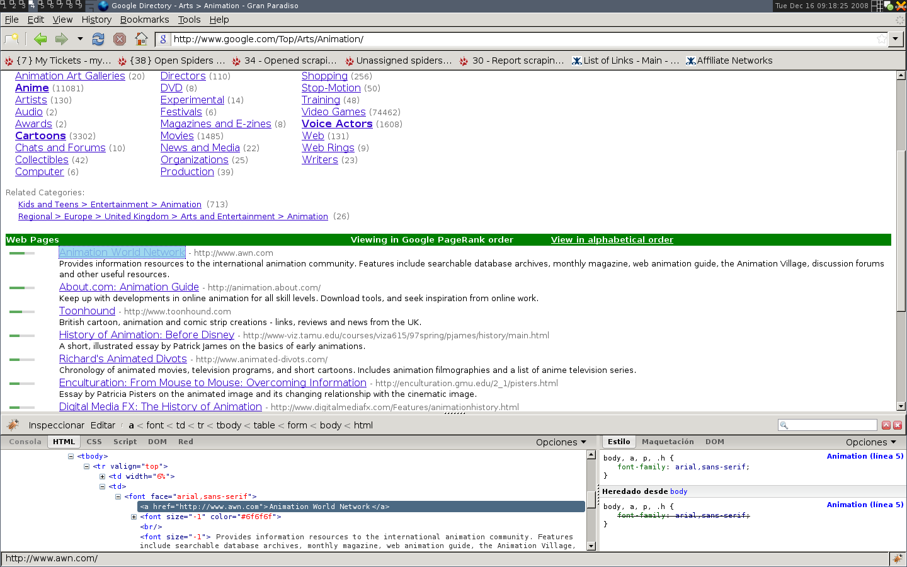

.. _tutorial3:

=================
Scraping our data
=================

We will now browse a page containing links to websites stored in the directory (e.g. http://www.google.com/Top/Arts/Awards/) and see how can we extract
the information we need with XPath.
As I said before, you'll need FireBug for this.

|
|
|

| As you can see, this page's markup is not very descriptive (there are no id or name attributes, or anything that identifies the links uniquely),
  so the ranking bars could be a nice reference at the moment of selecting the desired area with an XPath expression.
| After using FireBug, we can see that each link is inside a *td* tag, which is itself inside a *tr* tag that also contains the link's ranking bar.
| So we could find the ranking bar; then from it, find its parent (the *tr*), and then finally, the link's *td* (which contains the data we want to scrape).
|
| We loaded the page in the Scrapy shell (very useful for doing this), and tried an XPath expression in order to find the links, which actually worked.
| Basically, what that expression would mean is, "find any *td* tag who has a descendant tag *a* whose *href* attribute contains the string *#pagerank*"
  (the ranking bar's *td* tag), and then "return the *font* tag of each following *td* sibling that it has" (the link's *td* tag).
| Of course, this may not be the only way to get there (usually there are several expressions that get you to the same place), but it's quite good
  for this case.
| Another approach could be to find any *font* tags that have that grey colour of the links, but I prefer to use the first one because it wouldn't be
  so strange if there were other tags with the same colour.

Anyway, having said that, a possible *parse_category* could be::

    def parse_category(self, response):
        items = [] # The item (links to websites) list we're going to return
        hxs = HtmlXPathSelector(response) # The selector we're going to use in order to extract data from the page
        links = hxs.x('//td[descendant::a[contains(@href, "#pagerank")]]/following-sibling::td//a')

        for link in links:
            item = ScrapedItem()
            adaptor_pipe = [adaptors.extract, adaptors.Delist('')]
            item.set_adaptors({
                'name': adaptor_pipe,
                'url': adaptor_pipe,
                'description': adaptor_pipe,
            })

            item.attribute('name', link.x('a/text()'))
            item.attribute('url', link.x('a/@href'))
            item.attribute('description', link.x('font[2]/text()'))
            items.append(item)

        return items

| Okay, more new stuff here :) This time, items!
| Items are the objects we use to represent what you scrape (in this case, links).
| Basically, there are two important things about items: attributes, and adaptors.
|
| Attributes are nothing else but the places where you store the data you are extracting, which in this case are, the name of the linked website, its url, and a description.
| Now, in most cases, you'll have to do certain modifications to this data in order to store it (or do whatever you want to do with it), and this is done through the adaptors.
| Adaptors are basically a list of functions that receive a value, modify it (or not), and then return it.
| In this case we used only two adaptors:

* An extractor (*extract*), which, as you may imagine, extracts the data from the XPath nodes you provide, and returns it in a list.
* *Delist*, which joins the list that the previous adaptor returned into a string.
  This adaptor itself is a class, and this is due to the fact that you must specify which delimiter will join the list. That's why we put an instance to this adaptor in the list.

In this case, we used the same adaptors for every attribute, because we're practically doing nothing to the data, just extracting it. But there might be situations were certain attributes
are handled different than others (in fact, it *will* happen once you scrape more complicated sites with more complicated data).

The rest of the code is quite self-explanatory. The *attribute* method sets the item's attributes, and the items themselves are put into a list that we'll return to Scrapy's engine.
One simple (although important) thing to remember here is that you must always return a list that contains either items, requests, or both, but always as a list.

